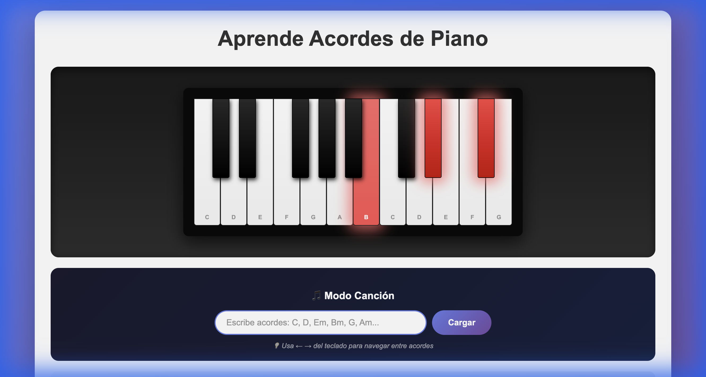
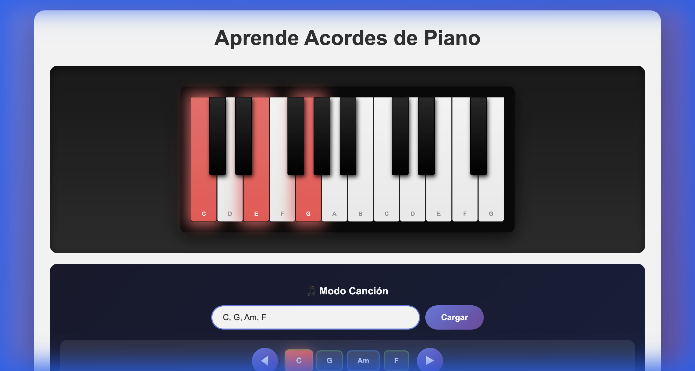

# Learn Piano Chords 🎹

An interactive web application to learn piano chords visually with audio feedback.



## ✨ Features

### 🎵 Chord Library (4 Categories)
- **Major Chords**: C, D, E, F, G, A, B
- **Major Sharp Chords**: C#, D#, F#, G#, A#
- **Minor Chords**: Cm, Dm, Em, Fm, Gm, Am, Bm
- **Minor Sharp Chords**: C#m, D#m, F#m, G#m, A#m

### 🔊 Audio Playback
- Real-time chord audio using **Web Audio API**
- Arpeggio effect for natural sound
- No external audio files needed

### ⌨️ Keyboard Controls
| Key | Action |
|-----|--------|
| C, D, E, F, G, A, B | Play chord (Major or Minor based on mode) |
| ← → | Navigate through song mode |

### 🎶 Song Mode
Create custom chord progressions for practice!



1. Type chords separated by commas: `C, G, Am, F`
2. Click **"Cargar"** (Load)
3. Navigate with **◀ ▶** buttons or arrow keys

**Supported formats:** `C, Dm, E, F#m, G#, Am`

## 🚀 How to Use

1. Open `index.html` in your browser
2. Click any chord button to see and hear it
3. Use **Mayor/Menor** toggle for keyboard mode
4. Enter a chord sequence in Song Mode for practice

## 🛠️ Technologies

- HTML5
- CSS3 (gradients, animations, glassmorphism)
- Vanilla JavaScript (Web Audio API)
- No dependencies!

## 📦 Deployment

### GitHub Pages (Automatic)

This project includes a GitHub Actions workflow for automatic deployment:

1. **Enable GitHub Pages:**
   - Go to Settings > Pages
   - Select "GitHub Actions" as source

2. **Push to main/master** - deployment is automatic!

3. **Access your app:**
   ```
   https://YourUsername.github.io/learn-piano/
   ```

## 🎹 Chord Theory

| Type | Formula |
|------|---------|
| Major | Root + Major 3rd + Perfect 5th |
| Minor | Root + Minor 3rd + Perfect 5th |

---

Made with ❤️ for piano learners